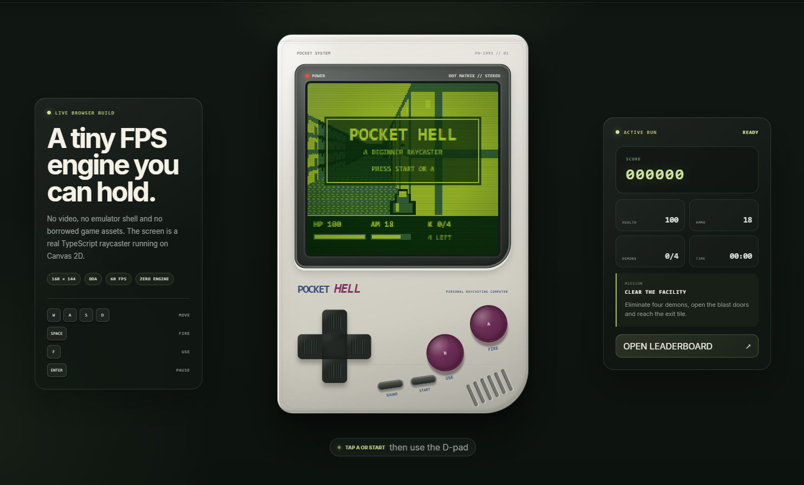

<div align="center">

# Pocket Hell

### A premium handheld raycasting FPS that starts playing the moment the page opens

[](https://davidusboy.github.io/pocket-hell/)
[](https://github.com/davidUSboy/pocket-hell/actions/workflows/ci.yml)
[](https://github.com/davidUSboy/pocket-hell/actions/workflows/deploy.yml)
[](https://www.typescriptlang.org/)
[](LICENSE)



[**Play now**](https://davidusboy.github.io/pocket-hell/) · [Architecture](docs/ARCHITECTURE.md) · [Customization](docs/CUSTOMIZATION.md) · [Contributing](CONTRIBUTING.md)

</div>

## What this project is

Pocket Hell is an original pseudo-3D first-person shooter built from scratch with TypeScript and Canvas 2D. It is not a video placed inside a console mockup: the display contains a real raycasting engine rendering a playable game world.

Version 2.0 is deliberately **game-first**. On phones, including iPhone Safari, the handheld fills the first viewport so a visitor can start playing without scrolling through a landing page. Desktop users see the full experience: premium console styling, onscreen controls, live game stats, and a leaderboard powered by GitHub Issues.

## Highlights

- **Real raycasting engine:** DDA wall casting, distance shading and a depth buffer for billboard sprites.
- **Complete game loop:** movement, collision, enemies, hitscan combat, doors, pickups, death, victory, score and time.
- **Premium handheld UI:** layered plastic, screen glass, scanlines, working D-pad, A/B/START controls.
- **Mobile-first controls:** pointer events, multi-touch-safe input, iOS safe areas and Visual Viewport scaling.
- **Installable experience:** web app manifest, Apple touch icon and offline application shell.
- **GitHub-powered leaderboard:** public scores are read from GitHub Issues through the public API.
- **No browser token:** publishing opens a prefilled GitHub issue, so no secret is exposed in client code.
- **Deployment-safe:** the committed browser runtime works from repository-root Pages, while the official workflow publishes the optimized Vite build.
- **Original assets:** pixel sprites, wall patterns, sounds, and console are generated by this project.

## Mobile experience

<div align="center">
  
</div>

The responsive layer uses `visualViewport` dimensions rather than relying only on CSS viewport units. Focus mode uses the Fullscreen API where supported and a CSS immersive fallback on iOS. Web Audio context starts with the first game input to comply with browser autoplay policies.

## Controls

| Action | Desktop | Handheld / touch |
| --- | --- | --- |
| Move forward / backward | `W` / `S` or arrows | D-pad up / down |
| Turn | `A` / `D` or arrows | D-pad left / right |
| Strafe | `Q` / `E` | Keyboard |
| Fire | `Space` | `A` |
| Open / use | `F` | `B` |
| Start / pause | `Enter` or `Escape` | `START` |
| Debug map | `M` | Keyboard |

Clear all four demons, collect what you need and reach the exit. A completed run is stored locally and can be submitted to the community board.

## Leaderboard architecture

The leaderboard intentionally avoids placing credentials in a static GitHub Pages application.

```text
Completed run
    │
    ├──► localStorage ──► This Device leaderboard
    │
    └──► prefilled GitHub Issue ──► public repository issues
                                      │
                                      └──► GitHub REST API ──► Community leaderboard
```

Only issues carrying the Pocket Hell score marker and expected numeric fields are displayed. The public board is an honor system suitable for an educational open-source project; a production competitor would require issue validation and rate limiting.

## Repository structure

```text
pocket-hell/
├── .github/
│   ├── ISSUE_TEMPLATE/score.yml   # leaderboard-compatible score form
│   └── workflows/                 # checks and Pages deployment
├── docs/                          # architecture, customization and previews
├── public/                        # Vite/PWA static assets
├── runtime/                       # committed browser-ready JavaScript fallback
├── scripts/validate.mjs           # repository and level validation
├── src/
│   ├── game/                      # engine, gameplay, input, audio and renderer
│   ├── ui/hands.ts                # action-driven finger animation
│   ├── leaderboard.ts             # local storage + GitHub API integration
│   ├── main.ts                    # application orchestration
│   └── style.css                  # premium handheld and responsive layout
├── index.html
├── service-worker.js
├── site.webmanifest
└── tsconfig.static.json
```

## Run locally

Requirements: Node.js 22.12 or newer. Node.js 24 is used by GitHub Actions.

```bash
git clone https://github.com/davidUSboy/pocket-hell.git
cd pocket-hell
npm install
npm run dev
```

Useful commands:

```bash
npm run compile:browser  # regenerate the committed runtime/ directory
npm run validate         # verify project files and level boundaries
npm run typecheck        # strict TypeScript check
npm run build            # create the optimized Vite build in dist/
npm run check            # validation plus production build
```

## GitHub Pages

The deployment workflow validates, type-checks and builds the project before publishing `dist/`. In **Settings → Pages**, use **GitHub Actions** as the source.

A browser-ready runtime is also committed and referenced with relative paths. This means the game remains styled and playable even during a Pages source misconfiguration that serves the repository root.

## Beginner learning path

A useful first session:

1. Change the map in `src/game/level.ts`.
2. Run `npm run validate` and keep the map boundary closed.
3. Tune movement, field of view and balance in `src/game/constants.ts`.
4. Follow one action from `InputManager` through `PocketHellGame` to `Renderer`.
5. Add a pickup, an enemy behavior or a second level.

Read [`docs/ARCHITECTURE.md`](docs/ARCHITECTURE.md) and [`docs/CUSTOMIZATION.md`](docs/CUSTOMIZATION.md) for the guided walkthrough.

## Legal

Pocket Hell is an original educational project inspired by early first-person shooters and handheld hardware. It does not include proprietary DOOM WAD files, DOOM artwork, Nintendo branding, commercial music or licensed assets. All code and media are original or procedurally generated.

Created by **Aleksei Lavrentev** (`davidUSboy`). Released under the [MIT License](LICENSE).
