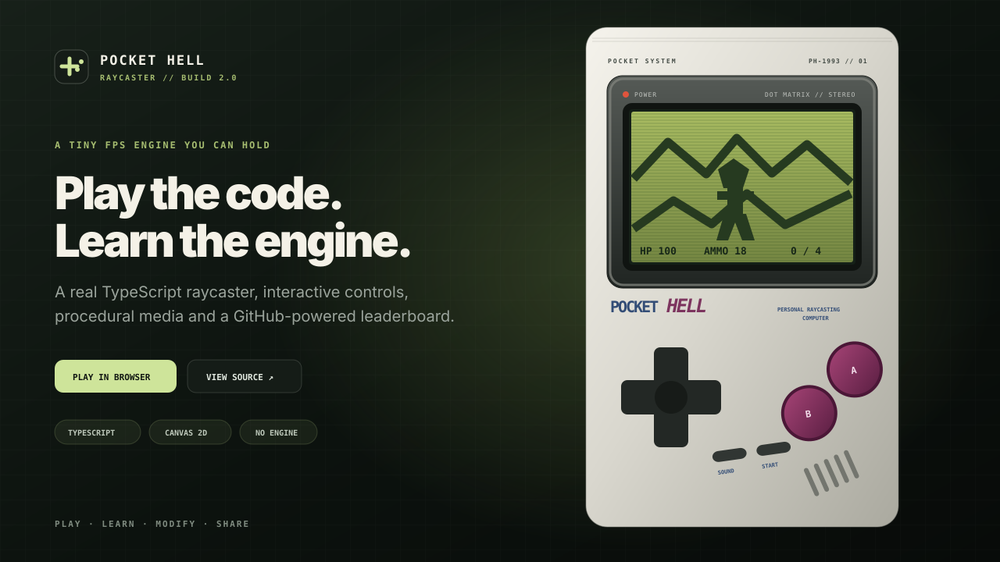

<div align="center">

# Pocket Hell

**A playable, beginner-friendly DOOM-style raycasting FPS built from scratch with TypeScript and Canvas 2D.**

[](https://davidusboy.github.io/pocket-hell/)
[](https://github.com/davidUSboy/pocket-hell/actions/workflows/ci.yml)
[](https://github.com/davidUSboy/pocket-hell/actions/workflows/deploy.yml)
[](https://www.typescriptlang.org/)
[](LICENSE)



[**Play in the browser**](https://davidusboy.github.io/pocket-hell/) · [Architecture](docs/ARCHITECTURE.md) · [Beginner learning path](docs/LEARNING_PATH.md) · [Русская инструкция](docs/START_HERE_RU.md)


</div>

## What is Pocket Hell?

Pocket Hell is a tiny first-person shooter and a readable game-development study project. The page is not a video inside a decorative console: the screen contains a real game, the buttons work with mouse and touch, and the animated thumbs react to the same actions as the player.

The project is intentionally compact enough for a beginner to trace from input to rendering, while still demonstrating the systems expected from a complete prototype: a frame loop, collision, raycasting, depth-buffered sprites, enemy behavior, combat, pickups, UI, procedural audio, responsive controls and automated deployment.

## Why this repository is useful

- **No game engine:** the pseudo-3D renderer is written directly against Canvas 2D.
- **No downloaded game assets:** sprites, wall patterns and sounds are generated in code.
- **One semantic input layer:** keyboard, pointer and touch controls drive the same actions.
- **Readable modules:** rendering, gameplay, audio, input, map data and hand animation are separated.
- **Beginner experiments included:** change the map, balance, palette or enemy behavior without rewriting the project.
- **Portfolio-ready presentation:** responsive landing page, social metadata, documentation, CI and GitHub Pages deployment.

## Gameplay systems

| System | What it demonstrates |
| --- | --- |
| Raycasting | Digital Differential Analysis turns a 2D tile map into a pseudo-3D view. |
| Depth buffer | Enemies and pickups disappear correctly behind walls. |
| Collision | Circle-based movement slides along walls and stops at closed doors. |
| Combat | Ammunition, hit windows, line of sight, damage, kills and weapon cooldown. |
| Enemy AI | Detection range, visibility checks, chase movement and melee attacks. |
| Interaction | Doors, health, ammunition, locked exit and win/death states. |
| Procedural media | Pixel sprites and Web Audio effects require no proprietary files. |
| Presentation | Interactive handheld controls and action-driven animated thumbs. |

## Controls

| Action | Keyboard | Handheld |
| --- | --- | --- |
| Move forward / backward | `W` / `S` or arrow keys | D-pad up / down |
| Turn | `A` / `D` or arrow keys | D-pad left / right |
| Strafe | `Q` / `E` | Keyboard only |
| Shoot | `Space` | `A` button |
| Open a door | `F` | `B` button |
| Pause / start | `Enter` or `Escape` | `START` |
| Debug minimap | `M` | Keyboard only |

Eliminate all four demons and reach the exit tile. Some rooms contain ammunition or health, and doors block parts of the map until the Use action is pressed.

## How raycasting works

The world is stored as a two-dimensional grid. For every vertical screen column, the renderer casts a ray through that grid until it reaches a blocking tile. The perpendicular hit distance determines the wall height; the wall side, distance and procedural pattern determine its monochrome shade.

Enemies and pickups are transparent canvases generated at runtime. They are transformed into camera space and tested against a one-value-per-column depth buffer before being drawn.

```text
InputManager ──► PocketHellGame.update(deltaTime) ──► Renderer.render(state)
                         │                                    │
                         ├─ movement + collision              ├─ wall rays
                         ├─ shooting + doors                  ├─ sprites
                         ├─ enemy AI                          ├─ weapon
                         ├─ pickups + exit                    └─ HUD + overlays
                         └─ game-state transitions
```

The complete walkthrough is in [`docs/ARCHITECTURE.md`](docs/ARCHITECTURE.md).

## Repository structure

```text
pocket-hell/
├── .github/
│   ├── workflows/            # quality checks and Pages deployment
│   └── ISSUE_TEMPLATE/       # structured bug and feature reports
├── docs/
│   ├── ARCHITECTURE.md       # engine walkthrough
│   ├── CUSTOMIZATION.md      # common modifications
│   ├── LEARNING_PATH.md      # guided beginner exercises
│   └── START_HERE_RU.md      # Russian quick start
├── public/                   # favicon, web manifest and social preview
├── scripts/
│   └── validate.mjs          # repository and map validation
├── src/
│   ├── game/
│   │   ├── audio.ts          # synthesized Web Audio effects
│   │   ├── constants.ts      # rendering and balance values
│   │   ├── game.ts           # update loop and gameplay rules
│   │   ├── input.ts          # keyboard, pointer and touch actions
│   │   ├── level.ts          # map data and entity spawns
│   │   ├── renderer.ts       # raycaster, sprites, weapon and HUD
│   │   └── types.ts          # shared TypeScript models
│   ├── ui/hands.ts           # input-driven thumb animation
│   ├── main.ts               # application bootstrap
│   └── style.css             # page, handheld and responsive layout
├── index.html
├── package.json
└── vite.config.ts
```

## Run locally

Requirements: Node.js 22.12 or newer. Node.js 24 is used in CI.

```bash
git clone https://github.com/davidUSboy/pocket-hell.git
cd pocket-hell
npm install
npm run dev
```

Vite prints the local address in the terminal.

Useful commands:

```bash
npm run validate   # verify map shape, boundaries, exit and required files
npm run typecheck  # run strict TypeScript checks
npm run build      # type-check and create the production site
npm run preview    # serve the production build locally
npm run check      # run all release checks
```

## Deploy to GitHub Pages

The workflow in [`.github/workflows/deploy.yml`](.github/workflows/deploy.yml) validates, type-checks, builds and publishes the `dist/` directory whenever `main` changes.

For a fork:

1. Open **Settings → Pages**.
2. Push a commit to `main` or run the deployment workflow manually.
3. The workflow configures GitHub Pages, builds the project and publishes the `dist/` directory.
4. Add the generated Pages URL to the repository's Website field if it is not already shown there.

The source buttons on the page automatically derive the correct repository URL when the project runs under `username.github.io/repository/`.


## Start learning

A useful first session takes about 30 minutes:

1. Change one row in `src/game/level.ts`.
2. Run `npm run validate` and fix any boundary error.
3. Change movement speed or field of view in `constants.ts`.
4. Give enemies one extra health point in `createEnemies()`.
5. Follow one shot from `InputManager` to `PocketHellGame.shoot()` and the renderer.

Continue with [`docs/LEARNING_PATH.md`](docs/LEARNING_PATH.md).

## Beginner-sized ideas

- Add animated doors instead of instantly removing a tile.
- Add armor or a second pickup type.
- Add a ranged enemy and visible projectile.
- Add gamepad support.
- Add a second level and level-selection screen.
- Save the best completion time with `localStorage`.
- Build a tiny browser map editor.

## Legal note

Pocket Hell is an original educational project inspired by early first-person shooters. It does not include proprietary DOOM WAD files, DOOM artwork, Nintendo branding, commercial sound effects or copied game code. The handheld shell, pixel sprites, wall patterns and audio are created by this project.

“DOOM-style” describes the genre and rendering approach only. Pocket Hell is not affiliated with or endorsed by id Software, ZeniMax, Nintendo or their owners.

## Author and license

Created by **Aleksei Lavrentev** (`davidUSboy`). Contributions are welcome; read [`CONTRIBUTING.md`](CONTRIBUTING.md) first.

Released under the [MIT License](LICENSE).
